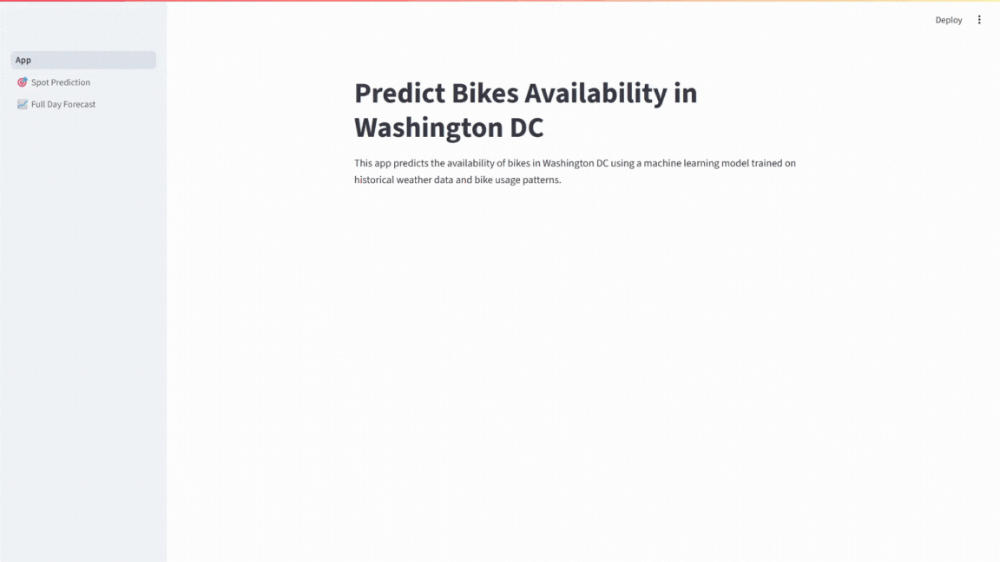

## Abstract

Ensuring availability is essential for delivering good service and enhancing customer experience in public bike-sharing systems, as well as for maintaining operational efficiency. This production-ready machine learning system predicts whether demand for public shared bicycles in Washington DC will be low or high, helping to address these challenges. It implements a full ML lifecycle, from exploratory data analysis, feature engineering, and model experimentation to deployment and real-time inference. Five ML algorithms were tested, with Random Forest selected for production based on recall performance. The system automatically fetches real-time weather forecast data from the Open-Meteo API, enabling more accurate demand estimation. It provides a FastAPI backend to deploy the model for inference, a visual Streamlit frontend (with single-hour and full-day demand forecasts), and Dockerized architecture for reproducible multi-service deployment.

##


## How to run

**Option A - With Docker:**

```bash
docker compose up
```

**Option B - Manually:**

Install requirements.

```bash
pip install -r requirements.txt
```

Run the model api:

```bash
uvicorn app.api.model-api:app --host 0.0.0.0 --port 80
```

Launch the web app:

```bash
streamlit run app/App.py --server.port=8501 --server.address=0.0.0.0
```

## Project Overview

Urban bike-sharing systems depend heavily on demand prediction to avoid shortages. This project builds and deploys a machine learning system that predicts bike availability for shared public bicycles in Washington DC based on weather data and previous demand.

With the focus on prioritizing recall, this system minimizes the risk of under-predicting high demand periods, reducing the likelihood of bike shortages.

It consists on:
- Exploratory data analysis & feature engineering in Jupyter notebooks.
- Model experimentation and evaluation with hyperparameter tuning.
- Production-ready deployment via FastAPI, Streamlit & Docker.

This project is build following a modular design, which supports scaling to other cities, retraining on new datasets, and extending to multiclass demand levels.

## Project Structure

- `app/` # Main app codebase
   - `api/` # FastAPI service for model inference and API utilities
   - `data/` # Datasets, preprocessed files, and scaler statistics
   - `model/` # Trained production model and saved best hyperparameters for each of the evaluated models
   - `pages/` # Streamlit app multi-page scripts
   - `utils/` # Reusable functions shared across the app
   - `App.py` # Entry point for the Streamlit app frontend
   - `feature_eng.py` # Script for feature engineering and preprocessing
   - `train_model.py` # Script to train and save the final production model
- `notebooks` # Jupyter notebooks for EDA, model training, experimentation, and evaluation

## Reproducing the Results

Follow these steps to reproduce the results:

1. **Install Dependencies**  
   - Ensure you have the required libraries by installing them from `requirements.txt`.

      ```bash
      pip install -r requirements.txt
      ```

2. **Data Analysis**
   - Open `notebooks/data_analysis.ipynb`.
   - Run all cells to view the results and graphs.

3. **Model Training and Optimization**
   - Open each notebook in the `notebooks/` directory.
   - Run all cells in each notebook. The optimal parameters for each model will be saved in the `app/model/best_params/` directory.

4. **Final Results**
   - Open `notebooks/main.ipynb`.
   - Run all cells to see the final evaluation with the results and graphs.

## Full Report:

Detailed methodology, experiments, and results are documented in:

📄 [Predict Bikes Availability Report](Predict-Bikes-Availability_Report.pdf)
